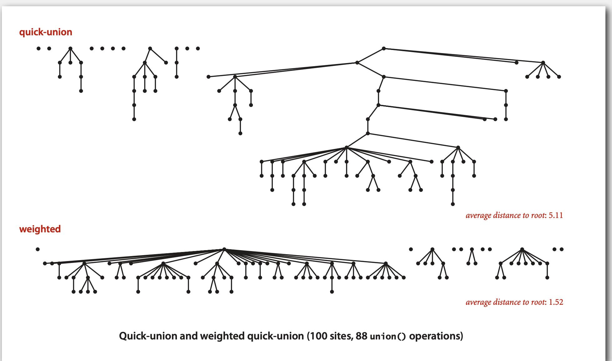
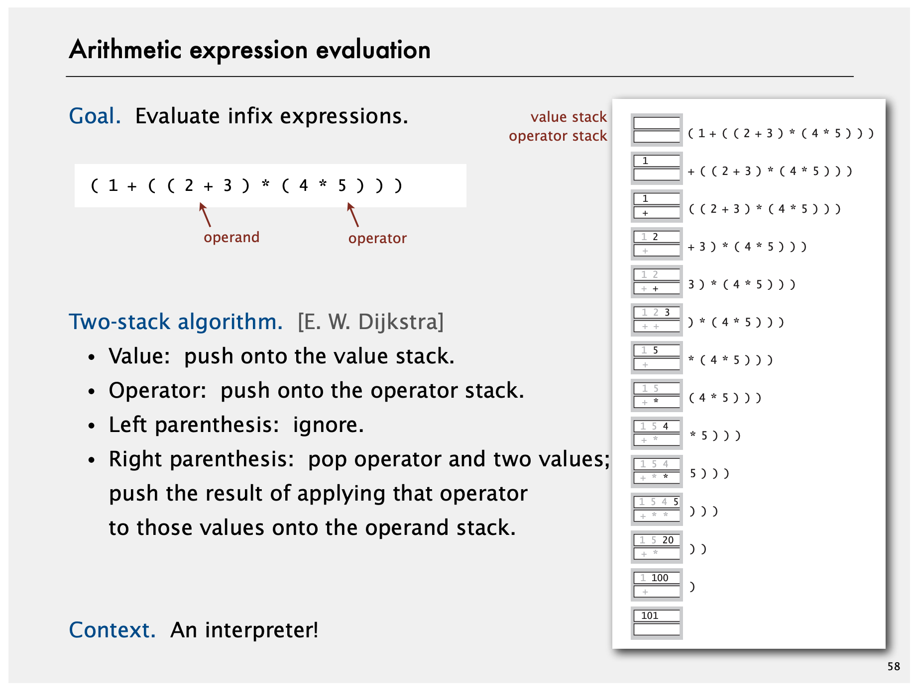

# 2 Union Find

## Dynamic Connectivity

## Quick Find

## Quick Union

## Improvement of Quick Union

- Weighted  

- Update path compression
    - Two-pass: The most flat version
    - One-pass variant: Half the path (not the best)

## Assignment: Percolation

- If it is required to *avoid compressing all iteration operations into a single method*,
you should consider splitting the tasks in to each method.  
The best case is making method runtime O(1), that means runtime doesn't increase with the input size.

- To avoiding iteration in a method, you don't want iterative searching.  
Instead, store data in a special position or structure (i.e. the `-1` index or hash table), then look up them directly.

# 4 Stack and Queue

