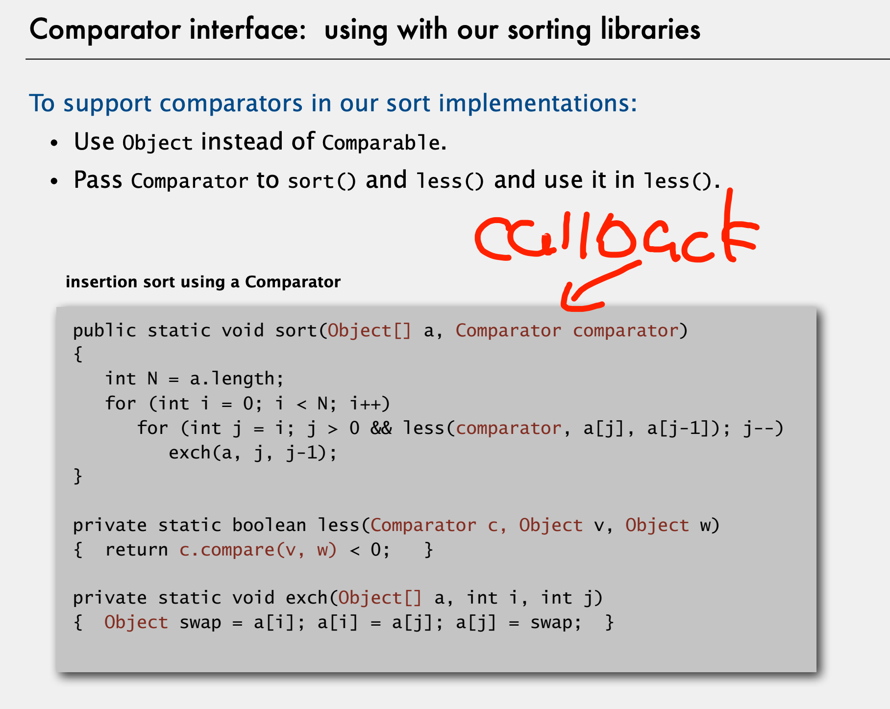
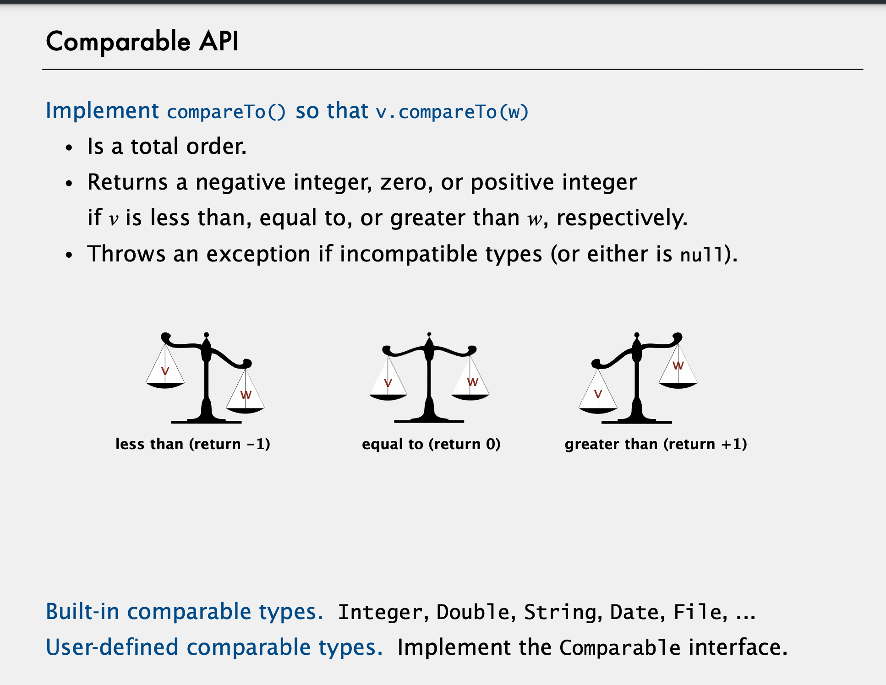
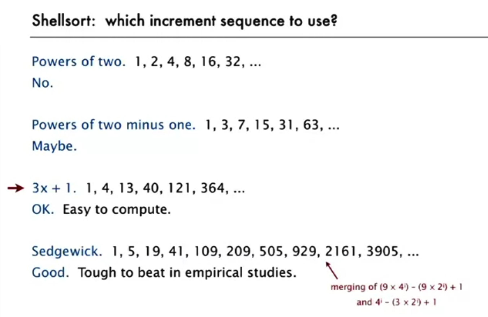

# 2 Union Find

## Dynamic Connectivity

## Quick Find

## Quick Union

## Improvement of Quick Union

- Weighted  

- Update path compression
    - Two-pass: The most flat version
    - One-pass variant: Half the path (not the best)

## Assignment: Percolation

- If it is required to *avoid compressing all iteration operations into a single method*,
you should consider splitting the tasks in to each method.  
The best case is making method runtime O(1), that means runtime doesn't increase with the input size.

- To avoiding iteration in a method, you don't want iterative searching.  
Instead, store data in a special position or structure (i.e. the `-1` index or hash table), then look up them directly.

# 4 Stack and Queue

# 5 Sorting Algorithms

Callback function: is a function that passed as arguments, and then is invoked by other function. aka. Reference to a executable code.

Natural numbers satisfies 'total order'

A total order is a binary relation ≤ that satisfies:
・Antisymmetry: if v ≤ w and w ≤ v, then v = w.
・Transitivity: if v ≤ w and w ≤ x, then v ≤ x.
・Totality: either v ≤ w or w ≤ v or both.

## Selection sort: $\theta(n^2)$
## Insertion sort: $\Omega(n), O(n^2)$
## Shell sort: $O(n^{3/2})$ when $n=3x+1$   
Based on insertion sort. But the exchange operations could be reduced.  
Given any $m, n$, sort on m and then n, m-sorted remains after n-sorted.  

## Shuffle:  
* Assign random numbers index and sort by index
* Knuth shuffle
## Convex Hull
Graham Scan: 
* Iterate through node in counter-clockwise. 
* Add the current node to vertices candidates.
* Test recursively, if any candidates (expect current) create a 'right turn' with the current node, remove them from candidates.
* The left is vertices of convex hull 

## Stability
A stable sort preserves the relative order of items with equal keys.

* Insertion: stable
* Selection: not stable
* Shell: not stable
* Merge: Stable